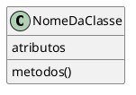
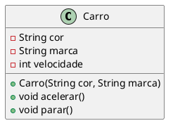
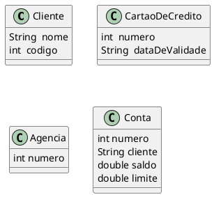
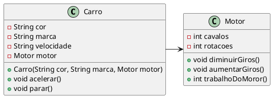
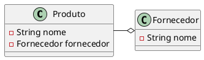
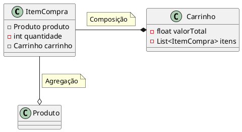

# Associações

## Estereótipo de uma Classe em UML

<figure>



<figcaption>Modelo de uma classe em UML.</figcaption>
</figure>


### Estrutura básica de uma classe

```java{3-5,7-11,13-18}
public class Carro {

    private String cor;
    private String marca;
    private int velocidade;

    public Carro(String cor, String marca){
        this.cor = cor;
        this.marca = marca;
        velocidade = 0;
    }

    public void acelerar(){
        velocidade++;
    }
    public void parar(){
        velocidade = 0; 
    }
}

```

```java
class Programa{
  public static void main(String[] args){
    Carro c1 = new Carro("vermelha","BMW");
    //Carro c2 = new Carro();// ERRO
  }
}

```

### Representação UML

<figure>



<figcaption> UML da classe carro.</figcaption>
</figure>

- A UML é uma notação que podemos utilizar para representar classes e objetos em modelos computacionais

- Linguagem para representação de modelos visuais com um significado especifico e padronizado

- UML não é uma linguagem de programação

- Os modelos são representados através de diagramas que possuem semântica própria
O diagrama que representa a descrição das classes é o **Diagrama de Classes**


## Domínio de Aplicação

- Um domínio é composto pelas entidades, informações e processos relacionados a um determinado contexto.
- Uma aplicação pode ser desenvolvida para automatizar ou tornar factível as tarefas de um domínio. 
- Portanto, uma aplicação é basicamente o "reflexo" de um domínio.
- Para exemplificar, suponha que estamos interessados em desenvolver uma aplicação para facilitar as tarefas do cotidiano de um banco. Podemos identificar clientes, funcionários, agências e contas como entidades desse domínio. Assim como podemos identificar as informações e os processos relacionados a essas entidades.

### Outras classes do domínio de um sistema bancário

<figure>



<figcaption> UML de classes do domínio bancários.</figcaption>
</figure>

# Associações
- Forma como uma classe se relaciona com outra classe
- Uma classe pode conter atributos que geram instâncias de outra classe
    - Uma classe pode conter outra classe como atributo
    - Quando isto ocorre dizemos que uma classe possui outra classe associada a ela

    
<figure>



<figcaption>Exemplo de Associação.</figcaption>
</figure>

## Agregação
- A classe contida não é instanciada no escopo da classe principal
    - Não depende da principal para existir 
    - Normalmente é passada por parâmetro

- Agregação é uma associação em que um objeto é parte de outro, de tal forma que a parte pode existir sem o todo.
- Em mais baixo nível, uma agregação consiste de um objeto contendo referências para outros objetos, de tal forma que o primeiro seja o todo, e que os objetos referenciados sejam as partes do todo.

<figure>



<figcaption>Exemplo de Agregação.</figcaption>
</figure>


## Composição
- A classe contida é instanciada pela classe principal 
- Quando uma classe principal é retirada da memória, as outras classes também são.
- O todo contém as partes (e não referências para as partes). Quando o todo desaparece, todas as partes também desaparecem.

<figure>



<figcaption>Exemplo de Composição.</figcaption>
</figure>

## Referências

<!-- @include: ../bib/bib.md -->