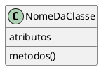
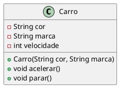
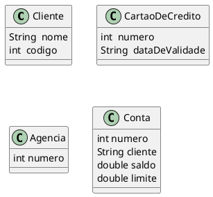

# Estereótipo de uma Classe em UML

<figure>



<figcaption>Modelo de uma classe em UML.</figcaption>
</figure>


## Estrutura básica de uma classe

```java{3-5,7-11,13-18}
public class Carro {

    private String cor;
    private String marca;
    private int velocidade;

    public Carro(String cor, String marca){
        this.cor = cor;
        this.marca = marca;
        velocidade = 0;
    }

    public void acelerar(){
        velocidade++;
    }
    public void parar(){
        velocidade = 0; 
    }
}

```

```java
class Programa{
  public static void main(String[] args){
    Carro c1 = new Carro("vermelha","BMW");
    //Carro c2 = new Carro();// ERRO
  }
}

```

## Representação UML

<figure>



<figcaption> UML da classe carro.</figcaption>
</figure>

- A UML é uma notação que podemos utilizar para representar classes e objetos em modelos computacionais

- Linguagem para representação de modelos visuais com um significado especifico e padronizado

- UML não é uma linguagem de programação

- Os modelos são representados através de diagramas que possuem semântica própria
O diagrama que representa a descrição das classes é o **Diagrama de Classes**


## Domínio de Aplicação

- Um domínio é composto pelas entidades, informações e processos relacionados a um determinado contexto.
- Uma aplicação pode ser desenvolvida para automatizar ou tornar factível as tarefas de um domínio. 
- Portanto, uma aplicação é basicamente o "reflexo" de um domínio.
- Para exemplificar, suponha que estamos interessados em desenvolver uma aplicação para facilitar as tarefas do cotidiano de um banco. Podemos identificar clientes, funcionários, agências e contas como entidades desse domínio. Assim como podemos identificar as informações e os processos relacionados a essas entidades.

### Outras classes do domínio de um sistema bancário

<figure>



<figcaption> UML de classes do domínio bancários.</figcaption>
</figure>