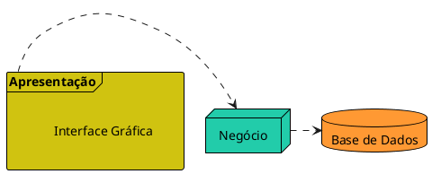
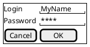

# Separação em Camadas

A separação da aplicação em camadas é um conceito fundamental em engenharia de software que se aplica a diversos tipos de sistemas, desde aplicativos de desktop até sistemas embarcados e serviços corporativos. O princípio básico é dividir o sistema em partes (camadas) com responsabilidades específicas, o que facilita a manutenção, a escalabilidade e a evolução da aplicação.

<figure>

<figcaption> Exemplo separação em camadas.</figcaption>
</figure>

## Conceitos Fundamentais

### Camada de Apresentação(UI - User Interface)

A camada de apresentação é responsável pela interação com o usuário, essa camada renderiza a interface visual e captura entradas. Isso inclui não apenas a exibição de dados, mas também a coleta de informações e a apresentação de feedback. O foco aqui é garantir que a interface seja intuitiva, responsiva e amigável para o usuário final.

A camada de apresentação pode ser uma tela web, desktop ou ate mesmo um chatbot

<figure>

<figcaption> Exemplo de tela de login.</figcaption>
</figure>

### Camada de Negócio (Business Logic)

A camada de negócio encapsula a lógica que implementa as regras e processos específicos da aplicação. Essa camada é onde são definidas as regras que governam como os dados podem ser manipulados e o que deve acontecer em determinadas situações.

Esta camada processa os dados recebidos da camada de apresentação, aplica as regras de negócio, e decide como responder a essas solicitações. 

### Camada de Dados(Data Access)

A camada de dados gerencia a persistência e o acesso aos dados da aplicação. Ela é responsável por interagir com bancos de dados, arquivos ou outros sistemas de armazenamento para garantir que os dados sejam armazenados e recuperados conforme necessário.

### Exemplo em um Sistema de Gerenciamento de Estoque

Considere um sistema de gerenciamento de estoque de uma loja que um operador utiliza para gerenciar produtos.

- **Camada de Apresentação:** Um formulário no aplicativo que permite ao operador adicionar um novo produto ao inventário, exibindo campos como nome, quantidade e preço.

- **Camada de Negócio:** Ao tentar remover um produto cuja quantidade no estoque não é zero, a camada de negócio detecta essa condição e gera uma exceção, informando que a operação não é permitida.

- **Camada de Dados:** Salvar as informações do novo produto no banco de dados quando o operador o adiciona via interface.

### Integração das Camadas

Imagine que o operador tenta registrar um produto com preço negativo. A camada de apresentação coleta os dados inseridos pelo usuário e os envia para a camada de negócio. A camada de negócio, ao detectar a violação da regra de negócio (preço negativo), retorna uma mensagem de erro para a camada de apresentação. É responsabilidade da camada de apresentação exibir essa mensagem de erro de forma clara e amigável ao operador, talvez em uma caixa de diálogo informando: "Erro: O preço do produto não pode ser negativo."

Esse processo garante que a lógica crítica do sistema, como as regras de negócio, seja tratada de forma centralizada e consistente, enquanto a camada de apresentação se concentra em como comunicar essas regras ao usuário final.

