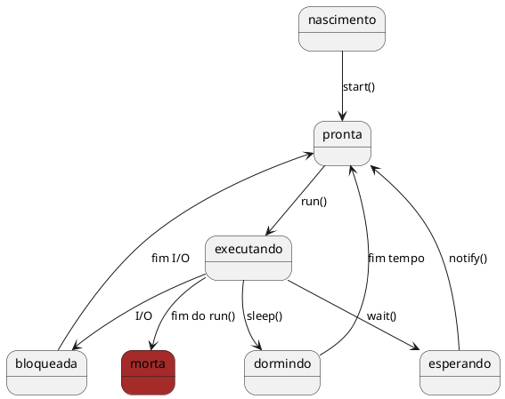

# Threads
- Threads são linhas de execuções que realizam tarefas simultâneas (caso tenhamos mais de 1 processador) ou de forma a compartilhar o processamento. 
- Cada thread é como um programa individual que tem total poder sobre a CPU.
- Java suporta explicitamente como parte da linguagem.
- Com o uso de Threads é possível dividir o programa em dois ou mais processos que podem rodar de forma paralela.
- Multithreading implica em duas ou mais tarefas rodando de forma concorrente (aparentemente em paralelo) dentro de um mesmo programa.
- Alguns programas necessitam fazer várias tarefas que requerem recursos computacionais diversos. Se estas tarefas podem ser feitas independentemente, então é possível usar threads para que o programa não fique limitado a performance dos recursos lentos (I/O).

```plantuml

@startgantt
[T1] lasts 5 days
[T2] lasts 3 days
[T2] starts at [T1]'s end
[T3] lasts 5 days
[T3] starts at [T2]'s end


[T1.1] as [T4] lasts 6 days
[T4] displays on same row as [T1]
[T4] starts at [T3]'s end

[T3.1] as [T5] lasts 4 days
[T5] displays on same row as [T3]
[T5] starts at [T4]'s end

	
[T2.1] as [T6] lasts 3 days
[T6] displays on same row as [T2]
[T6] starts at [T5]'s end

@endgantt
```

<figure>



<figcaption>Exemplo de uso de tempo do processador pelas Threads.</figcaption>
</figure>

<br>

<figure>



<figcaption>Diagrama de estado de uma Thread.</figcaption>
</figure>

- Existem duas formas para criar um thread: 
    - Estendendo a classe `Thread`
    - Implementando a interface `Runnable`. 
- Nos dois casos é necessário sobrescrever o método `run()` que é o " main()" do thread. 
- O método run deve conter a execução que irá rodar pelo tempo de vida do thread. Quando o método terminar, o thread morre. 

- Para iniciar o thread é necessário chamar o método `start()` . 
- É a maquina virtual quem controla a execução e o ciclo de vida do thread. 

## Herdando a classe Thread

@[code](./code/threads/MinhaThread.java)


## Implementando a interface Runnable

@[code](./code/threads/MeuRunnable.java)


## Executando Threads

@[code](./code/threads/App.java)


- Estendendo a classe Thread significa que a subclasse não pode estender qualquer outra classe, enquanto que a classe que implementa a interface Runnable tem essa opção.

## Synchronized
- Permite que blocos sensíveis ao acesso simultâneo sejam protegidos de corrupção
- Impede que objetos os utilizem ao mesmo tempo. 
    - Se um recurso crítico está sendo usado, só um thread tem acesso. 
    - É preciso que os outros esperem até que o recurso esteja livre. 
- Métodos sincronizados são métodos que são usados para controlar o acesso a um objeto. 
- Uma thread apenas executa um método sincronizado depois que adquiriu o bloqueio para o objeto do método ou classe. 
- Se o bloqueio já está em poder de outra thread, a thread chamada aguarda. 
- Uma thread abandona o bloqueio simplesmente ao finalizar do método sincronizado, permitindo que a próxima thread esperando por este bloqueio possa prosseguir. 
- Métodos sincronizados são úteis em situações em que os métodos podem manipular o estado de um objeto de formas que podem corromper o estado, se executados simultaneamente. 

```java
//...
public void metodo() {
    synchronized (this) {
    // conteudo do metodo
    }
}
//...

public synchronized void metodo() {
 // conteudo do metodo
}

//...
```


## Exemplo 

@[code](./code/threads/Conta.java)

@[code](./code/threads/ContaSynchronized.java)

@[code](./code/threads/ContaAtomic.java)

@[code](./code/threads/AppConta.java)

## Estados de uma Thread

- Nova Thread
    - Quando uma Thread é criada mas não foi chamado o start()
- Rodando
    - Quando o método start() é chamado em uma nova thread ela altera o seu estado para em execução é chamando o método run()
- Não Execução
    - Uma thread interrompe sua execução quando um quatro seguintes eventos ocorrem:
        - Quando o método sleep() é chamado e ele dorme por um período de tempo especificado
        - Quando o método suspend() é invocado
        - Quando o método wait() é chamado e a thread espera para a notificação de um recurso livre ou aguarda a conclusão de outra thread ou espera para adquirir um bloqueio de um objeto.
        - A thread está bloqueado em I / O e aguarda a sua conclusão

## Acessando informações da Threads
Thread.currentThread() pode retornar uma saída como Thread [threadA, 5, main]
- Sendo
    - nome da Thread
    - prioridade da thread 
    - nome do grupo a que pertence
## Prioridade de Execução
- Nas threads a prioridade pode ser setada a qualquer momento
    - setPriority()
    - getPriority()
- Thread 
    - MIN_PRIORITY (0)
    - NORM_PRIORITY (5)
    - MAX_PRIORITY (10)

## Gerenciando as Threads
- Dormir e acordar
    - A classe thread contém um método estático chamado sleep() que faz a thread em execução no momento pause sua execução e mude para o estado de sono. A thread vai dormir por pelo menos o tempo especificado em seu parâmetro, antes de entrar no estado executável. 
- Waiting and Notifying
    - Esperando e notificando fornecer os meios de comunicação entre as thread que sincroniza sobre o mesmo objeto. 
    - As threads executam os métodos wait() e notify() (ou notifyAll()) no objeto compartilhado para esta finalidade. 
    - O notifyAll (), notify() e wait() são métodos da classe Object. Estes métodos podem ser chamados apenas a partir de dentro de um contexto sincronizado (método sincronizado ou bloco sincronizado), caso contrário, a chamada irá resultar em um IllegalMonitorStateException. 
    - O notifyAll() método acorda todas as threads em espera no recurso. Nesta situação, as threads despertadas competem para o recurso. Uma threads recebe o recurso e os outros vão voltar a esperar.

# Processamento assíncrono em Java com Future e FutureTask

[^DEVMEDIA_ASSYNC]

Além da classe `Thread` e a interface `Runnable` para a programação de eventos assíncronos O java adicionou as classes FutureTaks`, `Future` e `Callable`, que tem mais ou menos a mesma função das anteriores, mas facilitam bastante o desenvolvimento de aplicações paralelas.

- **Future**: Classe que encapsula uma chamada feita em paralelo, sendo possível cancelar a execução de uma tarefa, descobrir se a execução já terminou com sucesso ou erro, entre outras operações;
- **FutureTask**: É uma implementação da interface Future a ser executada numa chamada em paralelo. Além disso, com ela é possível fazer as mesmas verificações que fazemos com a interface;
- **Callable**: Interface para a implementação de uma execução em paralelo. É muito parecida com a interface Runnable, mas esta não retorna nenhum valor, enquanto a Callable deve retornar um valor ao final da execução;
- **ExecutorService**: Classe para o gerenciamento de execuções em paralelo, já que cria um pool de threads, iniciando e cancelando as execuções. Também é possível cancelar este, evitando assim a criação de novas tarefas.

Imagine como implementar uma tarefa em paralelo que apenas gera números aleatórios. Isso foi feito na classe `GerarNumeroAleatorio` com a interface `Callable`. O método que deve ser implementado é o `call()` da interface, que ao final da execução retorna o valor gerado.

No `main` é criado um pool de threads e uma tarefa utilizando a classe `GerarNumeroAleatorio` na variável task. Assim, esse processo é enviado para o pool com o método `submit()` e nessa submissão é retornado um objeto do tipo `Future`. Com ele espera-se a execução terminar no `while`, que fica verificando se a thread terminou de executar com o método `isDone()`(isso acontecerá quando for retornado `true`). Então o valor aleatório gerado é retornado. Por fim, o valor retornado é impresso no console e o pool de threads é finalizado com o método `shutdown()`.


```java
package future;

import java.util.Random;
import java.util.concurrent.Callable;
import java.util.concurrent.ExecutionException;
import java.util.concurrent.ExecutorService;
import java.util.concurrent.Executors;
import java.util.concurrent.Future;

/**
 *
 * Classe que cria um pool de threads e cria uma thread do tipo GerarNumeroAleatorio
 que apenas gera um numero e o retorna para a classe que
 * criou a thread.
 *
 * @author Eduardo Santana
 *
 */
public class Exemplo1Print {

      private static final ExecutorService threadpool =
      Executors.newFixedThreadPool(3);

      public static void main(String args[]) throws InterruptedException,
      ExecutionException {
            GerarNumeroAleatorio task = new GerarNumeroAleatorio();
            System.out.println("Processando a tarefa ...");
            Future<Integer> future = threadpool.submit(task);
            while (!future.isDone()) {
                  System.out.println("A tarefa ainda não foi processada!");
                  Thread.sleep(1); // sleep for 1 millisecond
                  before checking again
            }
            System.out.println("Tarefa completa!");
            long factorial = (long) future.get();
            System.out.println("O número gerado foi: " + factorial);
            threadpool.shutdown();
      }

      // classe que implementa a interface Callable e retorna um numero aleatorio
      private static class GerarNumeroAleatorio implements Callable<Integer> {

            @Override
            public Integer call() {
                  Random rand = new Random();
                  Integer number = rand.nextInt(100);
                  return number;
            }

      }
}
```


Um exemplo um pouco maior, onde é calculado o fatorial de um número em uma tarefa que será executada em paralelo.

A tarefa é criada na variável `task` e é enviada para a execução paralela com o método `submit()`. Ao terminar é retornado o valor calculado que é impresso na tela.

A classe `Fatorial` é uma implementação da interface `Callable` e, por isso, implementa o método `call()`, que tem por objetivo calcular o fatorial do número passado como parâmetro. Para isso, é feito um comando while que vai multiplicando o valor já calculado por um número e subtraindo 1 deste até que ele chegue em 1.

```java
package future;
import java.util.concurrent.Callable;
import java.util.concurrent.ExecutionException;
import java.util.concurrent.ExecutorService;
import java.util.concurrent.Executors;
import java.util.concurrent.Future;
import java.util.logging.Level;
import java.util.logging.Logger;


public class Exemplo1 {

  private static final ExecutorService threadpool =
  Executors.newFixedThreadPool(3);

  public static void main(String args[]) throws
  InterruptedException, ExecutionException {

    Fatorial task = new Fatorial(20);
    System.out.println("Enviando a tarefa...");
    Future<Long> future = threadpool.submit(task);
    System.out.println("Task is submitted");
    while (!future.isDone()) {
      System.out.println("Tarefa não terminada ainda...");
      Thread.sleep(1); // espera para tentar novamente
    }
    System.out.println("Tarefa finalizada!");
    long factorial = (long) future.get();
    System.out.println("Fatorial de 10 é: " + factorial);
    threadpool.shutdown();

}

private static class Fatorial implements Callable<Long> {
    private final int number;

    public Fatorial(int number) {
          this.number = number;
    }

    @Override
    public Long call() {
      long output = 0;
      try {
            output = factorial(number);
      } catch (InterruptedException ex) {
            Logger.getLogger(Exemplo1.class.getName())
            .log(Level.SEVERE, null, ex);
      }
      return output;
    }

    private long factorial(int number) throws
    InterruptedException {
      if (number < 0) {
            throw new IllegalArgumentException
            ("Number must be greater than zero");
      }
      long result = 1;
      while (number > 0) {
            result = result * number;
            number--;
      }
      return result;
    }
  }
}
```

exemplo `GerarNumeroAleatorio` com 3 tarefas

```java
package future;
import java.util.Random;
import java.util.concurrent.Callable;
import java.util.concurrent.ExecutionException;
import java.util.concurrent.ExecutorService;
import java.util.concurrent.Executors;
import java.util.concurrent.Future;

public class Exemplo1Soma {

  private static final ExecutorService threadpool =
  Executors.newFixedThreadPool(3);

  public static void main(String args[]) throws
  InterruptedException, ExecutionException {

    GerarNumeroAleatorio tarefa1 = new GerarNumeroAleatorio();
    GerarNumeroAleatorio tarefa2 = new GerarNumeroAleatorio();
    GerarNumeroAleatorio tarefa3 = new GerarNumeroAleatorio();

    System.out.println("Processando a tarefa ...");
    Future<Integer> futureT1 = threadpool.submit(tarefa1);
    Future<Integer> futureT2 = threadpool.submit(tarefa2);
    Future<Integer> futureT3 = threadpool.submit(tarefa3);


    while (!futureT1.isDone() && futureT2.isDone()
    && futureT3.isDone()) {
          System.out.println("As tarefas ainda não foram
          processadas!");
          Thread.sleep(1); // sleep for 1 millisecond
          before checking again
    }
    System.out.println("Tarefa completa!");
    long valor = futureT1.get();
    valor = valor + futureT2.get() + futureT3.get();
    System.out.println("A soma dos valores gerados são:
    " + valor);
    threadpool.shutdown();
  }

  private static class GerarNumeroAleatorio implements
  Callable<Integer> {

    @Override
    public Integer call() {
      Random rand = new Random();
      Integer number = rand.nextInt(100);
      System.out.println("Valor Gerado: " + number);
      return number;
    }

  }
}
```


Agora vamos implementar um exemplo um pouco maior. No código abaixo é mostrado um servidor simples que recebe conexões na porta 8000. Ele é iniciado com uma thread onde é criada uma nova tarefa com o método execute. Esta é implementada com a classe `VerificaRequisicao`, que de 10 em 10 segundos verifica o status de todas as conexões feitas com o servidor, isto é, se ela foi cancela ou se foi terminada com sucesso.

Além disso, é necessário tratar a requisição de cada usuário e para isso foi implementado um processo bem simples, onde o servidor recebe uma mensagem do cliente e a responde com outra mensagem. Para isto utilizamos a classe `TrataRequisicao`, que recebe como parâmetro um `Socket` aberto com o cliente que fez a requisição. Foi colocado um `Thread.sleep` de cinco segundos na `Thread` que fica analisando as requisições que ainda não terminaram.

```java
package future;

import java.io.DataInputStream;
import java.io.DataOutputStream;
import java.io.IOException;
import java.net.ServerSocket;
import java.net.Socket;
import java.net.SocketTimeoutException;
import java.util.ArrayList;
import java.util.List;
import java.util.concurrent.ExecutorService;
import java.util.concurrent.Executors;
import java.util.concurrent.Future;

/**
 *
 * Implementacao de um servidor bem simples para demonstrar as varias
 formas de implementar programacao paralela com Java.
 *
 * @author Eduardo Santana
 *
 */
public class Servidor implements Runnable {

    private final ServerSocket serverSocket;
    private final ExecutorService pool;

    List<Future> requisicoes = new ArrayList<Future>();

    public static void main(String args[]) throws IOException {
          // cria uma Thread nova eexcutando o servidor
          System.out.println("Servidor no ar");
          new Thread(new Servidor(8000, 3)).run();
    }

    public Servidor(int port, int poolSize) throws IOException {
          serverSocket = new ServerSocket(port);
          pool = Executors.newFixedThreadPool(poolSize);
    }

    public void run() { // run the service
          try {
                //cria uma tarefa para a verificação das requisições
                pool.execute(new VerificaRequisicao(requisicoes));
                while (true) {
                      System.out.println("Nova requisição!");
                      Future req = pool.submit(new TrataRequisicao
                      (serverSocket.accept()));
                      // armazena todas as requisições
                      requisicoes.add(req);
                }
          } catch (IOException ex) {
                pool.shutdown();
          }
    }
}

// classe que executa de 10 em 10 segundos e verifica o status das requisições
class VerificaRequisicao implements Runnable {
      private final List<Future> requisicoes;

      VerificaRequisicao(List<Future> requisicoes) {
            this.requisicoes = requisicoes;
      }

      public void run() {
        while (true) {
              int somaTerminadas = 0;
              int somaCanceladas = 0;
              int somaEmExecucao = 0;
              try {
                    Thread.sleep(10000);
                    for (Future f : requisicoes) {
                          if (f.isDone()) {
                                somaTerminadas++;
                          } else if (f.isCancelled()) {
                                somaCanceladas++;
                          } else if (!f.isDone()) {
                                somaEmExecucao++;
                          }
                    }
                    System.out.println("Terminadas: " + somaTerminadas);
                    System.out.println("Canceladas: " + somaCanceladas);
                    System.out.println("Execução: " + somaEmExecucao);
              } catch (InterruptedException e) {
                    e.printStackTrace();
              }
        }
  }
}

// classe que recebe a requisição do cliente e a responde
class TrataRequisicao implements Runnable {
    private final Socket server;

    TrataRequisicao(Socket server) {
          this.server = server;
    }

    public void run() {
      try {
            System.out.println("Conectado a: " + server.getRemoteSocketAddress());
            DataInputStream in = new DataInputStream(server.getInputStream());
            System.out.println(in.readUTF());
            DataOutputStream out = new DataOutputStream(server.getOutputStream());
            Thread.sleep(5000);
            out.writeUTF("Sua conexão terminou! Tchau!");
            server.close();
      } catch (SocketTimeoutException s) {
            System.out.println("Socket timed out!");
      } catch (IOException e) {
            e.printStackTrace();
      } catch (InterruptedException e) {
            // TODO Auto-generated catch block
            e.printStackTrace();
      }
    }
}
```

Apenas para verificar o funcionamento do servidor foi implementado um cliente bem simples. A conexão é feita no endereço localhost da porta 8000. Depois de conectado, o cliente envia uma mensagem para o servidor e fica esperando a resposta.


```java
package future;

import java.io.DataInputStream;
import java.io.DataOutputStream;
import java.io.IOException;
import java.io.InputStream;
import java.io.OutputStream;
import java.net.Socket;

/**
*
* Cliente do servidor desenvolvido para testar as classes de execução em paralelo
*
* @author Eduardo Santana
*
*/
public class Cliente {

  public static void main(String[] args) {
    String serverName = "localhost";
    int port = 8000;
    try {
          System.out.println("Iniciando a conexão!");
          //faz a conexão
          Socket client = new Socket(serverName, port);
          System.out.println("Conectado a: " + client.getRemoteSocketAddress());
          OutputStream outToServer = client.getOutputStream();

          // envia a mensagem para o servidor
          DataOutputStream out = new DataOutputStream(outToServer);
          out.writeUTF("Olá Servidor! " + client.getLocalSocketAddress());

          // recebe a resposta do servidor
          InputStream inFromServer = client.getInputStream();
          DataInputStream in = new DataInputStream(inFromServer);

          //imprime a resposta
          System.out.println("Resposta: " + in.readUTF());
          client.close();
    } catch (IOException e) {
          e.printStackTrace();
    }

  }
}

```
## Virtual threads

[https://dev.to/cassunde/implementando-paralelismo-com-virtual-threads-no-java-21-3om8](https://dev.to/cassunde/implementando-paralelismo-com-virtual-threads-no-java-21-3om8)

[https://www.coffeeandtips.com/post/explorando-virtual-threads-no-java-21](https://www.coffeeandtips.com/post/explorando-virtual-threads-no-java-21)


<!--
TODO: Add Java CompletableFuture
TODO: Add Java Callable
https://www.baeldung.com/java-asynchronous-programming
https://www.devmedia.com.br/processamento-assincrono-em-java-com-future-e-futuretask/33851
https://www.digitalocean.com/community/tutorials/java-callable-future-example

https://howtodoinjava.com/java/multi-threading/java-callable-future-example/

-->


# Links w3schools

<ul>
    <li><a href="https://www.w3schools.blog/thread-life-cycle-in-java">Thread life cycle</a></li>
    <li><a href="https://www.w3schools.blog/way-of-creating-thread-in-java">Way of creating thread</a></li>
    <li><a href="https://www.w3schools.blog/better-way-to-create-a-thread-in-java">Which is a better way to create a
            thread?</a></li>
    <li><a href="https://www.w3schools.blog/methods-of-thread-class">Methods of Thread class</a></li>
    <li><a href="https://www.w3schools.blog/thread-start-vs-run-method">Difference between thread start and run
            method</a></li>
    <li><a href="https://www.w3schools.blog/why-we-call-start-method-in-thread">Why we call start method in thread?</a>
    </li>
    <li><a href="https://www.w3schools.blog/override-start-method-in-thread">Can we override start method?</a></li>
    <li><a href="https://www.w3schools.blog/override-run-method-in-thread">Can we override run method?</a></li>
    <li><a href="https://www.w3schools.blog/start-a-thread-twice">Is it possible to start a thread twice?</a></li>
    <li><a href="https://www.w3schools.blog/thread-scheduling-in-java">Thread scheduling</a></li>
    <li><a href="https://www.w3schools.blog/thread-priority-in-java">Thread priority</a></li>
    <li><a href="https://www.w3schools.blog/naming-a-thread-in-java">Naming a thread</a></li>
    <li><a href="https://www.w3schools.blog/joining-a-thread-in-java">What is join method?</a></li>
    <li><a href="https://www.w3schools.blog/daemon-thread-in-java">Daemon thread</a></li>
    <li><a href="https://www.w3schools.blog/call-run-method-directly">Can we call run method directly?</a></li>
    <li><a href="https://www.w3schools.blog/yield-sleep-thread-methods">What is the difference between sleep and yield
            method?</a></li>
    <li><a href="https://www.w3schools.blog/deadlock-in-java">Deadlock</a></li>
    <li><a href="https://www.w3schools.blog/starvation-in-java">Starvation</a></li>
    <li><a href="https://www.w3schools.blog/inter-thread-communication-in-java">Inter-thread communication</a></li>
    <li><a href="https://www.w3schools.blog/synchronization-in-java">Synchronization</a></li>
    <li><a href="https://www.w3schools.blog/synchronized-method-in-java">Synchronized method</a></li>
    <li><a href="https://www.w3schools.blog/static-synchronization-in-java">Static synchronization</a></li>
    <li><a href="https://www.w3schools.blog/synchronized-block-in-java">Synchronized block</a></li>
</ul>

<!-- @include: ../bib/bib.md -->
